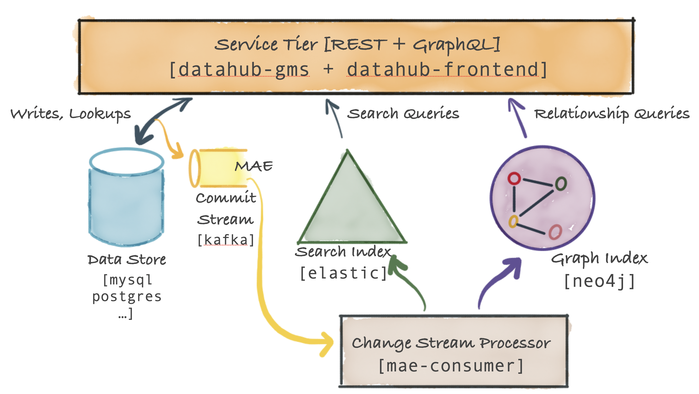

# DataHub Serving Architecture

The figure below shows the high-level system diagram for DataHub's Serving Tier. 

The primary service is called [gms](../../metadata-service) and exposes a REST API and a GraphQL API for performing CRUD operations on metadata. The metadata service also exposes search and graph query API-s to support secondary-index style queries, full-text search queries as well as relationship queries like lineage. In addition, the [datahub-frontend](../../datahub-frontend) service expose a GraphQL API on top of the metadata graph. 

## DataHub Serving Tier Components

### Metadata Storage

The DataHub Metadata Service (gms) persists metadata in a document store (could be an RDBMS like MySQL, Postgres or a key-value store like Couchbase etc.). 

### Metadata Commit Log Stream (MAE)

The DataHub Service Tier also emits a commit event [Metadata Audit Event (MAE)] when a metadata change has been successfully committed to persistent storage. This event is sent over Kafka. 

The MAE stream is a public API and can be subscribed to by external systems providing an extremely powerful way to react in real-time to changes happening in metadata. For example, you could build an access control enforcer that reacts to change in metadata (e.g. a previously world-readable dataset now has a pii field) to immediately lock down the dataset in question.
Note that not all MCE-s will result in an MAE, because the DataHub serving tier will ignore any duplicate changes to metadata.

### Metadata Index Applier (mae-consumer-job)

[MAE]-s are consumed by another Kafka Streams job, [mae-consumer-job], which applies the changes to the [graph] and [search index] accordingly. 
The job is entity-agnostic and will execute corresponding graph & search index builders, which will be invoked by the job when a specific metadata aspect is changed. 
The builder should instruct the job how to update the graph and search index based on the metadata change. 
The builder can optionally use [Remote DAO] to fetch additional metadata from other sources to help compute the final update.

To ensure that metadata changes are processed in the correct chronological order, MAEs are keyed by the entity [URN] — meaning all MAEs for a particular entity will be processed sequentially by a single Kafka streams thread. 

### Metadata Query Serving

Primary-key based reads (e.g. getting schema metadata for a dataset based on the `dataset-urn`) on metadata are routed to the document store. Secondary index based reads on metadata are routed to the search index (or alternately can use the strongly consistent secondary index support described [here]()). Full-text and advanced search queries are routed to the search index. Complex graph queries such as lineage are routed to the graph index.

[RecordTemplate]: https://github.com/linkedin/rest.li/blob/master/data/src/main/java/com/linkedin/data/template/RecordTemplate.java
[GenericRecord]: https://github.com/apache/avro/blob/master/lang/java/avro/src/main/java/org/apache/avro/generic/GenericRecord.java
[DAO]: https://en.wikipedia.org/wiki/Data_access_object
[Pegasus]: https://linkedin.github.io/rest.li/DATA-Data-Schema-and-Templates
[relationship]: ../what/relationship.md
[entity]: ../what/entity.md
[aspect]: ../what/aspect.md
[GMS]: ../what/gms.md
[MAE]: ../what/mxe.md#metadata-audit-event-mae
[rest.li]: https://rest.li

[Metadata Change Event (MCE)]: ../what/mxe.md#metadata-change-event-mce
[Metadata Audit Event (MAE)]: ../what/mxe.md#metadata-audit-event-mae
[MAE]: ../what/mxe.md#metadata-audit-event-mae
[equivalent Pegasus format]: https://linkedin.github.io/rest.li/how_data_is_represented_in_memory#the-data-template-layer
[graph]: ../what/graph.md
[search index]: ../what/search-index.md
[mce-consumer-job]: ../../metadata-jobs/mce-consumer-job
[mae-consumer-job]: ../../metadata-jobs/mae-consumer-job
[Remote DAO]: ../architecture/metadata-serving.md#remote-dao
[URN]: ../what/urn.md
[Metadata Modelling]: ../modeling/metadata-model.md
[Entity]: ../what/entity.md
[Relationship]: ../what/relationship.md
[Search Document]: ../what/search-document.md
[metadata aspect]: ../what/aspect.md
[Python emitters]: https://datahubproject.io/docs/metadata-ingestion/#using-as-a-library
