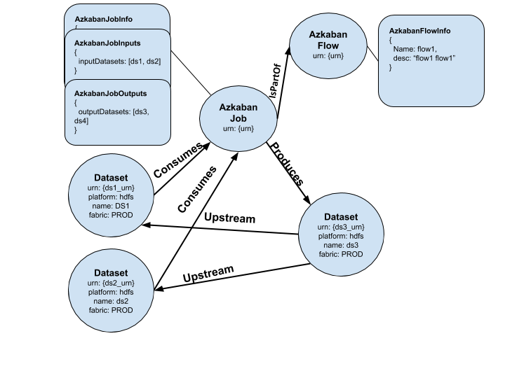

- Start Date: 2020-08-25
- RFC PR: https://github.com/datahub-project/datahub/pull/1820
- Implementation PR(s): https://github.com/datahub-project/datahub/pull/1732

# Azkaban Flows and Jobs

## Summary

Adding support for [Azkaban](https://azkaban.github.io/) job and flow metadata and enabling search and discovery for them. 

The design includes the metadata needed to represent Azkaban jobs and flows as data job entities and their relationships to other
entities like Datasets.

## Motivation

Azkaban is a popular open source workflow manager created and extensively used at LinkedIn. Azkaban metadata is a critical piece
in the metadata graph since data processing jobs are the primary driver of data movement and creation.

Without job metadata, it is not possible to understand the data flow across an organization. Additionally, jobs are needed in the
lineage graph to surface operational metadata and have a complete view of data movement and processing. Capturing jobs and flows
metadata in the lineage graph also allows in understanding dependency between multiple flows and jobs and structure of data 
pipelines in end to end data flow.

## Requirements

The following requirements exists as part of this rfc:

- Define Data flow and job as entities and model metadata for azkaban data job and flows
- Enable Search & Discovery for Data jobs and flows
- Link DataJob entities to existing entities like Datasets to build a more complete metadata graph
- Automatically derive dataset upstream lineage from data job metadata (inputs and outputs)

## Non Requirements

Azkaban has its own application to surface jobs, flows, operational metadata and job logs. DataHub doesn't intend to be
a replacement for it. Users will still need to go to Azkaban UI to look at logs and debug issues. DataHub will only show
important and high level metadata in the context of search, discovery and exploration including lineage and will link to
Azkaban UI for further debugging or finer grained information.

## Detailed design



The graph diagram above shows the relationships and high level metadata associated with Data Job and Flow entities.

An Azkaban flow is a DAG of one or more Azkaban jobs. Usually, most data processing jobs consume one or more inputs and 
produce one of more outputs (represented by datasets in the diagram). There can be other kinds of housekeeping jobs as well
like cleanup jobs which don't have any data processing involved.

In the diagram above, the Azkaban job node consumes datasets `ds1` and `ds2` and produces `ds3`. It is also linked to the
flow it is part of. As shown in the diagram, dataset upstream lineage is derived from the azkaban job metadata which results
in `ds1` and `ds2` being upstreams of `ds3`.

### Entities
There will be 2 top level GMA [entities](../../../what/entity.md) in the design: DataJob and DataFlow.

### URN Representation
We'll define two [URNs](../../../what/urn.md): `DataJobUrn` and `DataFlowUrn`.
These URNs should allow for unique identification for a Data job and flow respectively.

DataFlow URN will consist of the following parts:
1. Workflow manager type (e.g. azkaban, airflow etc)
2. Flow id - Id of a flow unique within a cluster
3. Cluster - Cluster where the flow is deployed/executed

DataJob URN will consist of the following parts:
1. Flow Urn - Urn of the data flow this job is part of
2. Job id - Unique id of the job within the flow

An example DataFlow URN will look like below:
```
urn:li:dataFlow:(azkaban,flow_id,cluster)
```

An example DataJob URN will look like below:
```
urn:li:dataJob:(urn:li:dataFlow:(azkaban,flow_id,cluster),job_id)
```

### Azkaban Flow metadata

Below is a list of metadata which can be associated with an azkaban flow:

- Project for the flow (the concept of project may not exist for other workflow managers so it may not apply in all cases)
- Flow name
- Ownership

### Azkaban Job metadata

Below is a list of metadata which can be associated with an azkaban job:

- Job name
- Job type (could be spark, mapreduce, hive, presto. command etc)
- Inputs consumed by the job
- Outputs produced by the job

## Rollout / Adoption Strategy

The design references open source Azkaban so it is adoptable by anyone using Azkaban as their
workflow manager.

## Future Work
 
1. Adding operational metadata associated with Azkaban entities
2. Adding azkaban references in Upstream lineage so that the jobs show up in the lineage graph